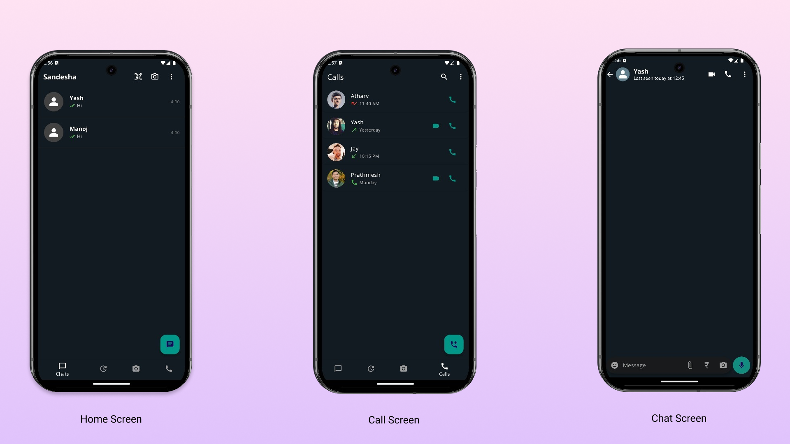

# Sandesha - Flutter Chat Application

Welcome to Sandesha - a real-time chat application built with Flutter. Sandesha allows users to connect seamlessly through instant messaging, featuring a sleek UI, real-time message updates, and secure authentication. Whether for casual chats or professional discussions, Sandesha ensures a smooth and enjoyable user experience.

## Features

- **Real-time Messaging: Instant communication with WebSocket-based real-time updates.

- **Secure Authentication: Login with phone number and OTP verification for a secure experience.

- **User-friendly Interface: Simple and intuitive UI that ensures seamless navigation.

- **Media Sharing: Send images, videos, and documents with ease.

- **Chat Encryption: End-to-end encryption ensures privacy and security.

- **Group Chats: Create and manage group conversations effortlessly.

- **Custom Emojis & Stickers: Express yourself with a variety of emojis and stickers.

- **Read Receipts & Typing Indicator: Know when your messages are read and see when the other user is typing.

- **Profile Customization: Update your profile picture, status, and personal details.

## Screenshots

## Acknowledgements

We would like to thank the Flutter community for their continuous support and valuable contributions.

## Contact

If you have any questions or suggestions regarding Sandesha, feel free to contact us at prathmeshsuhagpure3@gmail.com.

Thank you for using Sandesha! We hope you enjoy fast and secure chatting with our app. 🚀💬

